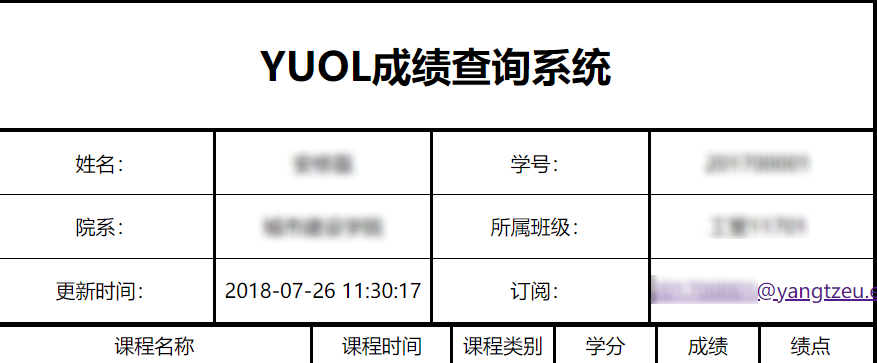
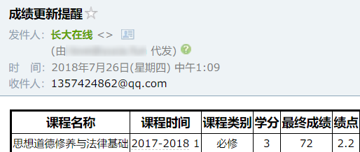

# 暑期主作业
主要分为两块  
1. 运行flask
2. 检查订阅用户，每天2次从教务处更新信息，有更新则通过邮件推送给用户  
## 目录结构
- [app.py](app.py) flask主文件  
- [config.py](config.py) 配置(不完全)  
- [api.py](api.py) 包含获取用户信息`get_info()`，为用户添加订阅标记`mailupdate()`(这个的函数名称没想到合适的)，发送邮件`sendmail()`等函数
- [remind.py](remind.py)
- [static/](static/) 静态文件目录
- [templates/index.html](templates/index.html) 登录页面 
- [templates/info.html](templates/info.html) 信息展示页面
- [templates/remind.html](templates/remind.html) 订阅页面

## flask
分了三个路由:`/`,`/info`,`/remind`,分别对应登录页面，信息页面，订阅页面(相当~简~丑陋)
数据储存的主要结构是:
```
{
    "学号":"xxx",
    "密码":"xxx",
    "订阅":"123@qq.com",
    ...
    一些杂项
    ...
    "成绩":{
        ...
        ...
    },
    "学籍信息":{

    }
    ...
    成绩相关
    ...
}
```
获取用户信息时弃用了selenium，改用了requests
## 成绩推送
没有搭建邮件服务器，使用了阿里的邮件推送服务(每天200免费额度)，测试时也可直接使用QQ/网易邮箱与其对应的授权码
就是简单的每天定时从数据库中取出订阅了的用户，然后检查这些用户的成绩是否有更新，有更新的话就将成绩推送到邮箱。
邮件发送参照了[菜鸟教程-Python3 SMTP](http://www.runoob.com/python3/python3-smtp.html)  
定时运行任务使用了schedule库，需要先pip安装
简单使用:
```
import schedule
def test():
    print("123")
schedule.every().day.at("05:00").do(test)
schedule.every().day.at("17:00").do(test)
while 1:
    schedule.run_pending()
# 这个脚本会再每天的05:00和17:00调用test()函数，方法不能传入参数
# test不需用加()，只需传入函数名称
```
api.sendmail()里面隐去了账户信息，使用前需先补充完整
### 附
新增了`订阅`项目，系统只会检查已经`订阅`的用户的数据。，因为数据量不小，若每天爬取全部用户的数据，可能给源网站带来压力(源网站会罢工)，也不能保证不会出bug。若用户没有留下邮箱信息，即使获取到了更新后的数据，也没办法进行推送。  
没有对[remind.py](remind.py)进行测试，因为数据库中没有太多信息。只对检查数据更新和发送邮件进行了测试。只要定时检查的逻辑没有问题，其他的应该是没有问题的。

## 附
app.py和remind.py可以单独运行起来，放在后台运行可以使用:  
`nohup python3 app.py >> app.log 2>&1 &`    
`nohup python3 remind.py >> remind.log 2>&1 &`  
18/8/16更新:
发现可以使用guincorn启动flask,`gunicorn -w 2 -b :3100 app:app --daemon`   
gunicorn简单理解就是可以管理flask进程，要是flaks进程死了，guincorn可以将它重新拉起来
## 完成图
  

